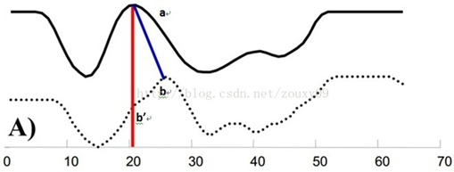
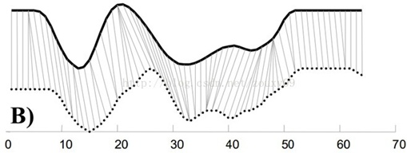
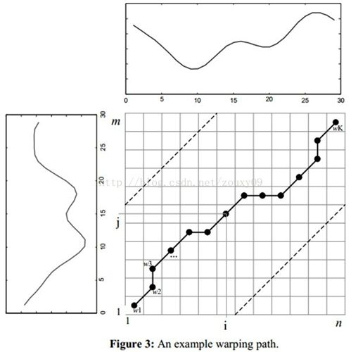

# Dynamic Time Warping(DTW)动态时间规整

## 1. 问题背景

在时间序列中，需要比较相似性的两段时间序列的长度可能并不相等，在语音识别领域表现为不同人的语速不同。而且同一个单词内的不同音素的发音速度也不同，比如有的人会把“A”这个音拖得很长，或者把“i”发的很短。

另外，不同时间序列可能仅仅存在时间轴上的位移，亦即在还原位移的情况下，两个时间序列是一致的。在这些复杂情况下，使用传统的欧几里得距离无法有效地求的两个时间序列之间的距离（或者相似性）。






在上图A中，实线和虚线分别是同一个词“pen”的两个语音波形（在y轴上拉开了，以便观察）。可以看到他们整体上的波形形状很相似，但在时间轴上却是不对齐的。例如在第20个时间点的时候，实线波形的a点会对应于虚线波形的b’点，这样传统的通过比较距离来计算相似性很明显不靠谱。因为很明显，实线的a点对应虚线的b点才是正确的。而在图B中，DTW就可以通过找到这两个波形对齐的点，这样计算它们的距离才是正确的。


## 2. DTW详解

DTW是一类典型的优化问题，通常采用动态规划算法求解。

假设我们有两个时间序列$Q$和$C$，他们的长度分别为$n$和$m$：
$$
Q=q_{1},q_{2},\cdots ,q_{n}
$$

$$
C=c_{1},c_{2},\cdots ,c_{m}
$$

首先，我们依然采用两个序列中每一对“点”之间的距离来计算形似度，即使两个序列中的点的个数可能不一样。

不过，因为可以warping规整时间轴，所以，我们并不是在两个序列中依次取一对点来计算距离，而是每个点有可能对应于另一个序列中的多个点。


我们需要将连个序列对齐。最简单的对齐方式就是**线性缩放**了。把短的序列线性放大到和长序列一样的长度再比较，或者把长的线性缩短到和短序列一样的长度再比较。`但是这样的计算没有考虑到语音中各个段在不同情况下的持续时间会产生或长或短的变化，因此识别效果不可能最佳。`因此更多的是采用**动态规划**的方法。


为了对其两个这两个序列，我们需要构造一个$n×m$的矩阵网格，矩阵元素$(i,j)$表示$q_{i}$和$c_{j}$两点之间的距离$d(q_{i},c_{j})$，每一个矩阵元素$(i,j)$表示$q_{i}$与$c_{j}$对齐。DP算法可以归纳为寻找一条通过此网格中若干格点的路径。




我们把这条路径定义为规整路径(warping path)，并用$W$来表示：
$$
W=w_{1},w_{2},\cdots ,w_{k},\space\space\space\space\space max\{m,n\}\leqslant k<m+n-1
$$
当然这条规整路径需要满足一定要求：

1. 边界条件：

   $w_{1}=(1,1)$和$w_{k}=(m,n)$, 两个人分别说了同一个单词，但是由于语速、语气、语调等等各不相同，会导致采样得到的数据**无法对齐**。但是两段语音采样的第一个采样值和最后一个采样值肯定是两两对应的。因此所选的路径必定是从左下角出发，在右上角结束。

2. 连续性：

   如果$w_{k-1}=(a',b')$，那么对于路径的下一个点$w_{k}=(a,b)$需要满足$(a-a')\leqslant 1$ 和 $(b-b')\leqslant 1$。也就是不可能跨过某个点去匹配，只能和自己相邻的点对齐。这样可以保证$Q$和$C$中的每个坐标都在$W$中出现。

3. 单调性：

   如果$w_{k-1}=(a',b')$，那么对于路径的下一个点$w_{k}=(a, b)$需要满足$0<=(a-a’)$和$0<= (b-b’)$。这限制$W$上面的点必须是随着时间单调进行的，以保证图B中的虚线不会相交。


由连续性和单调性可知，每次格点$(i, j)$前进方向只有三种：$(i+1, j)$，$(i, j+1)$，$ (i+1, j+1)$。我们的目的是使得下面的规整代价最小的路径：
$$
DTW(Q,C)=min(\frac{\sum_{k=1}^{K}W_{k}}{K})
$$
分母中的$K$主要是用来对不同的长度的规整路径做补偿。***因为不同的路径其长短不同，较长的路径有较多的“点对”，会有较多的距离累加上去，所以总距离除以$K$得到单位路径的距离（还不太理解。。。）***

这里我们定义一个累加距离(cumulative distances)。从(0, 0)点开始匹配这两个序列$Q$和$C$，每到一个点，之前所有的点计算的距离都会累加。到达终点(n, m)后，这个累积距离就是我们上面说的最后的总的距离，也就是序列$Q$和$C$的相似度。

示例：

给定一个样本序列X和对比序列Y:

X：3，5，6，7，7，1

Y：3，6，6，7，8，1，1

试计算X和Y之间的最小路径。

DTW首先会根据序列点之间的距离(欧氏距离)，获得一个序列距离矩阵 M，其中行对应X序列，列对应Y序列，矩阵元素为对应行列中X序列和Y序列点到点的欧氏距离：

| X/Y  |  3   |  6   |  6   |  7   |  8   |    1    |  1   |
| :--: | :--: | :--: | :--: | :--: | :--: | :-----: | :--: |
|  3   |  0   |  3   |  3   |  4   |  5   |    2    |  2   |
|  5   |  2   |  1   |  1   |  2   |  3   |    4    |  4   |
|  6   |  3   |  0   |  0   |  1   |  2   | ***5*** |  5   |
|  7   |  4   |  1   |  1   |  0   |  1   |    6    |  6   |
|  7   |  4   |  1   |  1   |  0   |  1   |    6    |  6   |
|  1   |  2   |  5   |  5   |  6   |  7   |    0    |  0   |

然后根据距离矩阵生成`损失矩阵(Cost Matrix)`或者叫`累积距离矩阵 `$M_{c}$，其计算方法如下：
1. 第一行第一列元素为 $M$ 的第一行第一列元素，在这里就是0；

2. 其他位置的元素$ (M_{c}(i,j))$的值则需要逐步计算，具体值的计算方法为 $M_{c}(i,j)=Min(M_{c}(i−1,j−1),M_{c}(i−1,j),M_{c}(i,j−1))+M(i,j)$，得到的$M_{c}$如下：

  | X/Y  |  3   |  6   |  6   |  7   |    8    |  1   |  1   |
  | :--: | :--: | :--: | :--: | :--: | :-----: | :--: | :--: |
  |  3   |  0   |  3   |  6   |  10  |   15    |  17  |  19  |
  |  5   |  2   |  1   |  2   |  4   |    7    |  11  |  15  |
  |  6   |  5   |  1   |  1   |  2   | ***4*** | `9`  |  14  |
  |  7   |  9   |  2   |  2   |  1   |    2    |  8   |  14  |
  |  7   |  13  |  3   |  3   |  1   |    2    |  8   |  14  |
  |  1   |  15  |  8   |  8   |  7   |    8    |  2   |  2   |

最后，两个序列的距离，由损失矩阵最后一行最后一列给出，在这里也就是2。


```python
import sys
import numpy as np


def cal_dtw(s1, s2):
    d = lambda x, y: abs(x - y)

    ts_a, ts_b = np.array(s1), np.array(s2)
    m, n = len(ts_a), len(ts_b)

    cost = sys.maxsize * np.ones((m, n))

    # 初始化第一个元素
    cost[0, 0] = d(ts_a[0], ts_b[0])

    # 计算损失矩阵第一列
    for i in range(1, m):
        cost[i, 0] = cost[i - 1, 0] + d(ts_a[i], ts_b[0])

    # 计算损失矩阵第一行
    for j in range(1, n):
        cost[0, j] = cost[0, j - 1] + d(ts_a[0], ts_b[j])

    # 计算损失矩阵剩余元素
    for i in range(1, m):
        for j in range(1, n):
            choices = cost[i - 1, j - 1], cost[i - 1, j], cost[i, j - 1]
            cost[i, j] = min(choices) + d(ts_a[i], ts_b[j])

    return cost[-1, -1]


if __name__ == '__main__':
    ts_a = [1, 5, 8, 10, 56, 21, 32, 8]
    ts_b = [1, 5, 8, 10, 23, 56, 21, 32, 8]
    ts_c = [1, 3, 6, 9, 16, 29, 31, 32, 33]

    # 调用cal_dtw_distance计算dtw相似度
    dtw_ab = cal_dtw(ts_a, ts_b)
    dtw_ac = cal_dtw(ts_a, ts_c)

    print(dtw_ab)
    print(dtw_ac)

```


## 3. 参考资料

1. [DTW(Dynamic Time Warping)动态时间规整](https://zhuanlan.zhihu.com/p/32849741)
2. [算法笔记-DTW动态时间规整](https://blog.csdn.net/raym0ndkwan/article/details/45614813)
3. [维基百科-Dynamic Time Warping](https://en.wikipedia.org/wiki/Dynamic_time_warping)

