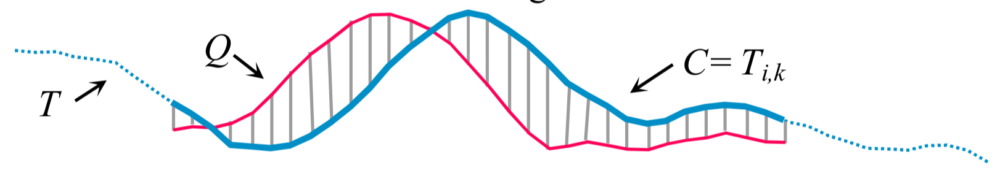

# 对【基于DTW的搜索和挖掘数万亿个时间序列子序列】的理解

本文是对[Searching and Mining Trillions of Time Series Subsequences under Dynamic Time Warping](http://www.cs.ucr.edu/~eamonn/UCRsuite.html)文献的阅读总结。文章主要是基于DTW算法，在实现细节上进行了诸多优化，提出了所谓的UCR-Suite，可以实现大规模时间序列的**精确、快速**搜索。

# 1. 概述

在人类活动中，时间序列数据是非常普遍的。大多数时间序列数据挖掘算法都需要进行相似度比较作为核心子例程。越来越多的研究证明DTW算法是最佳的度量。但是，很多这类算法太耗时了（too computationally expensive）。既然DTW是最好的度量，如何优化是本文的重点和创新点。

关于DTW，参见[Dynamic Time Warping(DTW)动态时间规整](https://www.jianshu.com/p/893c2b0d7e75)

## 1.1 文章假设

文章所做工作基于如下四点假设：

1. 时间序列必须归一化（Time Series Subsequences must be Normalized）

   对两个时间序列的比较必须进行归一化处理，否则，你的加速技术只能在un-normalized数据上生效，从而效果大打折扣。

   需要注意的是：**在进行序列比较时，必须对每一个子序列进行归一化处理，而不是只对整个数据集进行归一化处理。**

2. DTW算法是最好的度量（Dynamic Time Warping is the Best Measure）

   作者对大量的文献进行对比分析，认为DTW仍然是最好的距离度量。因此作者将DTW作为优化的目标。

3. 不能为任意查询长度建立索引（Arbitrary Query Lengths cannot be Indexed）

   一是现有索引技术所建立的索引所需的空间占到数据的1/10，从数量级上来说，我们需要double amount of disk space;

   二是，正则化会使索引失效。

   以上两点只是针对任意查询长度问题而言。

4. 存在需要大量计算时间才能解决的数据挖掘问题（There Exists Data Mining Problems that we are willing to Wait Some Hours to Answer）

# 2. 背景和说明

**时间序列T定义**
$$
T=t_{1},t_{2},\cdots ,t_{m}
$$
**子序列**$T_{i,k}$
$$
T_{i,k}=t_{i},t_{i+1},\cdots ,t_{k}, 1\leq i\leq m-k+1
$$
**Euclidean distance(ED)**
$$
ED(Q,C)=\sqrt{\sum_{i=1}^{n}(q_{i}-c_{i})^{2}} \space \space \space where |Q|=|C|
$$
以上定义可用下图形象说明：

DTW相关知识，参见[Dynamic Time Warping(DTW)动态时间规整](https://www.jianshu.com/p/893c2b0d7e75)

# 3. 已知的优化算法

文章列举了几个已知的基于ED/DTW的序列搜索优化算法：

## 3.1 使用平方距离（Using the Squared Distance）

在ED和DTW使用的是平方根计算方法，但是去掉开根号并不改变近临的相关度排序，因为函数都是单调和凸的。但是，没有开根号有利于后续的优化和解释。

## 3.2 使用下界进行剪枝（Lower Bounding）

利用计算时间复杂度低的下界（lower bound）对不太满意的候选序列C进行剪枝是一种常用的加速技巧。

文章提到三种lower bound:

$LB\__{Kim}FL$ : 左图所示，使用首（或尾）端点的距离作为下界，所以时间复杂度为$O(1)$;

$LB\__{Keogh}$ : 右图所示，使用候选序列C和查询序列Q最近的包络{U,L}的欧几里得距离作为下界，因此时间复杂度为$O(n)$;

$LB\__{Kim}$ : 

##  3.3 提前终止计算ED和$LB\__{Keogh}$（Early Abandoning of ED and $LB\__{Keogh}$）

在计算ED或者$LB\__{Keogh}$的过程中，如果在某一点得到的距离累加值超过了当前最优值，就没有必要继续计算了。

## 3.4 提前终止计算DTW（Early Abandoning of DTW）

如果已经完成一整个$LB\__{Keogh}$的计算，在接下来计算DTW时有一个技巧，可以判断是否能提前终止计算，如下图所示：

以$K$作为计算的分界线，则$DTW(Q_{1:n},C_{1:n})$的下界可表示成：

$DTW(Q_{1:K},C_{1:K})+LB\__{Keogh}(Q_{K+1:n},C_{K+1:n})$

如果这个下界已经超过了当前最优值，则可以放弃当前候选序列$C$.

## 3.5 利用多核技术

# 4. 算法创新

文章介绍了基于ED/DTW的4个创新优化点，作者称为UCR-Suite.

## 4.1 提前终止Z-Normalization计算（Early Abandoning Z-Normalization）

本文将提前终止ED（或Keogh下界距离）计算与在线归一化计算（online Z-Normalization）结合。如此，可以提前终止Z-Normalization计算。

Z-Normalization的计算公式为：$Z=\frac{x-\mu }{\sigma }$，在这里我们想计算每一个$m$长子序列的均值和标准差，计算公式如下：

## 4.2 重排序提前终止（Reordering Early Abandoning）

在计算距离/正则化时，都是沿着序列总左往右计算，这种计算顺序是最佳的吗？很明显不是的，不同的计算顺序有不同的计算效率。

但是，通用的最佳计算顺序是什么，很难回答，因为可能的计算顺序有$n!$这么多个。

作者根据经验推测，最佳的计算顺序是基于Z-normalizatied的序列$Q$的绝对值的索引从大到小排序的顺序为最好的计算顺序。

## 4.3 交换查询序列与候选序列在$LB\__{Keogh}$中的角色（Reversing the Query/Data Role in $LB\__{Keogh}$）

之前我们介绍$LB\__{Keogh}$的时候说到，该LB是围绕Query计算的上下确界，将一个query给几何上包裹住。这么做的好处在于我们的计算只针对每一个query，相比于计算整个time series的所有子序列显然简单得多。但是作者这里提出，在一些情况下，由于对于query的LB会较为松散（比对于candidate计算的大一半），所以我们如果在某些情况下对candidate进行LB计算，可以过滤掉不少没必要的DTW，从而总得节省了计算这个LB的开销。如下图所示：

上图左：根据查询序列$Q$的上下确界{$U,L$}和候选序列$C$来计算$LB\__{Keogh}$；

上图右：根据候选序列$C$的上下确界{$U,L$}和查询序列$Q$来计算$LB\__{Keogh}$.

## 4.4 级联下界（Cascading Lower Bounds）

相比用一个固定的Lower bound来剪枝候选序列，作者采用了一种由松到紧的方式渐进改变$LB$，作者采用的$LB$按使用的先后顺序排序，有：$LB\__{Kim}FL$、 $LB\__{Keogh}EQ$、 $LB\__{Keogh}EC$

作者采用这种方式，在大规模查找任务中，可以减少99.9999%的DTW计算。

# 5. 算法总结

作者使用了四种模型，分别是原始DTW/ED模型，使用之前的优化方法的SOTA-DTW模型和这篇文章的UCR模型，在不同的任务中进行了对比。在千亿级短序列搜索任务中比SOTA提速了12倍，在长序列搜索中提速10倍。

文章针对DTW在大数据挖掘的应用，在实现细节上进行了大致4个方面的优化，主要是通过时间复杂度小的算法优先排除掉不合格的候选序列，从而减少不必要的计算，实现算法加速。