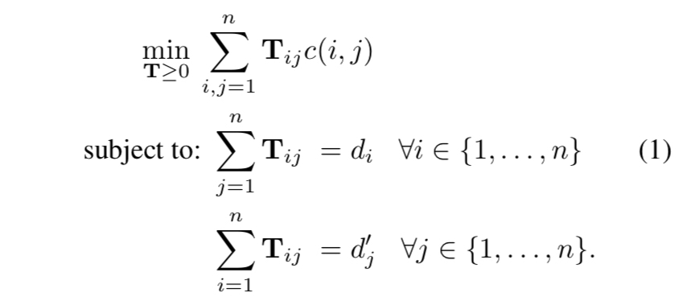
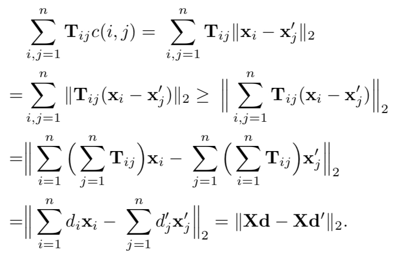
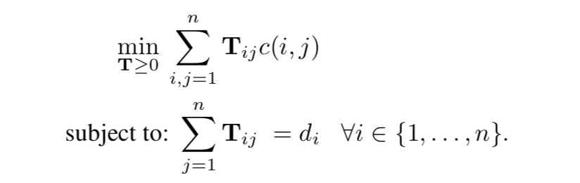

# 对【From Word Embeddings To Document Distances】的理解

论文题目：From Word Embeddings To Document Distances

作者：Matt J. Kusner, Yu Sun, Nicholas I. Kolkin, Kilian Q. Weinberger

文章发表于32届International Conference on Machine Learning.


## 1. 储备知识

### 1.1 Earth Mover's Distance

Earth Mover's Distance(EMD)是一种运输问题的优化算法，主要用于计算两个不同维度分布之间的距离。

参考资料如下：

1. [The Earth Mover's Distance](http://homepages.inf.ed.ac.uk/rbf/CVonline/LOCAL_COPIES/RUBNER/emd.htm#RUBNER98A)
2. [图像检索:EMD距离(Earth Mover's Distance)及纠错](https://blog.csdn.net/zhangping1987/article/details/25368183)
3. [EMD距离(Earth Mover's Distance)](https://www.jianshu.com/p/2b171e1b43d4)
4. [The Earth Mover’s Distance as a Metric for Image Retrieval](http://robotics.stanford.edu/~rubner/papers/rubnerIjcv00.pdf)
5. [A Metric for Distributions with Applications to Image Databases](https://users.cs.duke.edu/~tomasi/papers/rubner/rubnerIccv98.pdf)
6. [Fast and Robust Earth Mover’s Distances](https://www.cse.huji.ac.il/~werman/Papers/ICCV2009.pdf)

[Fast and Robust Earth Mover’s Distances](https://www.cse.huji.ac.il/~werman/Papers/ICCV2009.pdf)的算法是本文作者所采用的。


### 1.2 BOW和TF-IDF

#### 1.2.1 Bag-of-words(BOW)

将所有词语装进一个袋子里，不考虑其词法和语序的问题，即每个词语都是独立的，例如下面两句话：

Jane wants to go to Shenzhen.

Bob wants to go to Shanghai.

就可以构成一个袋子，用一个字典来建立映射匹配：

```python
{"Jane":1, "wants":2, "to":3, "go":4, "Shenzhen":5, "Bob":6, "Shanghai":7}
```

那么上面两个例句就可以用以下两个向量表示，对应的下标与映射数组的下标相匹配，其值为该词语出现的次数：

```python
[1,1,2,1,1,0,0]
[0,1,2,1,0,1,1]
```

这两个词频向量就是词袋模型，可以很明显的看到语序关系已经完全丢失。

参考：[词袋模型（BOW，bag of words）和词向量模型（Word Embedding）概念介绍](https://www.cnblogs.com/chenyusheng0803/p/10978883.html)


#### 1.2.2 TF-IDF

TF-IDF(Term Frequency-Inverse Document Frequency, 词频-逆文件频率)是一种用于信息检索（information retrieval）与文本挖掘（text mining）的常用**加权技术**。

 TF-IDF是一种统计方法，用以评估一字词对于一个文件集或一个语料库中的其中一份文件的重要程度。**字词的重要性随着它在文件中出现的次数成正比增加，但同时会随着它在语料库中出现的频率成反比下降。**

TF-IDF的主要思想是：如果某个单词在一篇文章中出现的频率TF高，并且在其他文章中很少出现，则认为此词或者短语具有很好的类别区分能力，适合用来分类。

**TF(Term Frequence)**:

表示词条在文本中出现的频率：
$$
tf_{ i,j }=\frac { n_{ i,j } }{ \sum _{ k }{ n_{ k,j } }  }
$$
其中，$n_{i,j}$是该词在文件$d_{j}$中出现的次数，分母则是文件$d_{j}$中所有词汇出现的次数总和。


**IDF(Inverse Document Frequence)：**

某一词条$t_{i}$的IDF，可以由**总文件数目除以包含该词语的文件的的数目，再将得到商取对数得到。**如果包含该词条$t_{i}$的文档越少，IDF越大，说明词条具有很好的类别区分能力。
$$
idf_{ i }=log\frac { \left| D \right|  }{ 1+\left| \{ j:t_{ i }\in d_{ i }\}  \right|  }
$$
其中，$|D|$是语料库中文件的总数。$| \{ j:t_{ i }\in d_{ i }\}|$表示包含词条$t_{i}$的文件数目。一般分母+1，为了防止该词条不再语料库中而导致分母为0.


**TF-IDF：**
$$
TF-IDF = TF * IDF
$$
某一特定文件内的高词语频率，以及该词语在整个文件集合中的低文件频率，可以产生出高权重的TF-IDF。因此，TF-IDF倾向于过滤掉常见的词语，保留重要的词语。

**TF-IDF不足之处：**

1. 没有考虑特征词的**位置因素**对文本的区分度，词条出现在文档的不同位置时，对区分度的贡献大小是不一样的；

2. 按照传统TF-IDF，往往一些生僻词的IDF(反文档频率)会比较高、因此这些**生僻词**常会被误认为是文档关键词；

3. 传统TF-IDF中的IDF部分只考虑了特征词与它出现的文本数之间的关系，而忽略了特征项在一个类别中不同的类别间的**分布情况**；

4. 对于文档中出现次数较少的重要人名、地名信息提取效果不佳。
   

参考：

1. [TF-IDF算法介绍及实现](https://blog.csdn.net/asialee_bird/article/details/81486700)
2. [TF-IDF原理及使用](https://blog.csdn.net/zrc199021/article/details/53728499)


## 2. 内容概述

在文档检索、新闻分类、多语言文档匹配等领域，精确计算文档距离具有重要的意义。

常用的模型有BOW和TF-IDF，但它们有如下缺点：

1. 频率近似正交性（frequence near-orthogonality）( 不太懂，是因为矩阵中含有大量0的元素吗？);
2. 不能很好描述个体单词之间的距离。


本文利用word2vec模型，提出了一种度量两个文档距离的方法Word Mover's Distance(WMD)。WMD的优化问题可归结为Earth Mover's Distance(EMD)问题的特例，而EMD问题有很好的现成solver。


同时，文章还讨论了几种下界（Lower bound），并提出了RWMD 下界。相比其他下界，RWMD具有更好的紧致性（tight）。


## 3. Word2Vec Embedding

Word2Vec是2013年由Mikolov等人提出的一个词向量计算工具。它通过一个浅层神经网络语言模型学得每个词的向量表达。

对于一组给定的单词序列$w_{1},\cdots ,w_{T}$，训练的目标是：
$$
\max { \frac { 1 }{ T }  } \sum _{ t=1 }^{ T }{ \sum _{ j\in nb(t) }^{  }{ \log { p\left( { w_{ j } }|{ w_{ t } } \right)  }  }  } 
$$
其中，$nb(t)$是单词$w_{t}$相邻单词集合。

该方法有两点优势：

1. 训练高效：因为模型解构简单，同时使用层序softmax可以降低计算复杂度；
2. 可以学得复杂词之间的关系。


## 4. Word Mover's Distance

### 4.1 WMD算法推导

在给出优化目标函数前，先解释几个定义：

假设用nBOW向量表示文档，$\textbf d \in R^{n}$， 定义
$$
d_{ i }=\frac { c_{ i } }{ \sum _{ j=1 }^{ n }{ c_{ j } }  } 
$$
表示第$i$个单词在文档中出现的频率，显然，$\textbf d$是一个稀疏矩阵。


**Word travel cost：**

单词$i$和单词$j$之间的距离定义为：
$$
c(i,j)=\left\| \textbf x_{ i }- \textbf x_{j} \right\| _{2}
$$


**Document distance:**

这里定义文档距离用的就是Earth Mover's Distance的思想。

设矩阵$\textbf T \in R^{n×n}$，$\textbf T_{ij} \ge 0$表示文档$\textbf d$中有多少单词$i$ travel 到 文档$\textbf d'$单词$j$，明显，下列等式成立：

$\sum _{ j }^{  }{ \textbf T_{ i,j } } =d_{ i }$，$\sum _{ i }^{  }{ \textbf T_{ i,j } } =d_{ j }^{'}$

从而，定义文档间距离为：$\min { \sum _{ i,j=1 }^{ n }{ \textbf T_{ i,j } } c\left( i,j \right)  } $


**Transportation problem:**

文档$\textbf d$和$\textbf d'$之间的最小转移距离可以表示为如下线性规划问题：



wmd距离示意图：


### 4.2 加速计算

WMD算法的最佳平均时间复杂度为$O(p^{3}\text {log}p)$，对于高维情况和大量文档，计算是非常耗时的。

作者提出了两种时间复杂度低的lower bound，可以初步过滤掉绝大多数不满足的文档，从而避免不必要的WMD距离计算。


**Word centroid distance:**

wcd下界的推导如下，其时间复杂度为$O(dp)$:




**Relaxed word moving distance(RWMD):**

wcd虽然计算速度很快，但是不够紧致（tight）,作者提出了更加紧致（tighter）的RWMD下界：

就是在原问题的基础上，去掉一个约束条件：



优化技巧是：


从而：


更进一步地，可以去掉另外一个约束，分布计算$\sum _{ j }^{  }{ {\textbf T }_{ ij }^{ * }c\left( i,j \right)  } $，取其较大者，作为下界：
$$
l_{ r }\left( \textbf{d,d' }\right) =\max { \left( l_{ 1 }\left(\textbf{d,d'} \right) ,l_{ 2 }\left(\textbf{ d,d'} \right)  \right)  }
$$


### 4.3 计算工作流

1. 利用WCD对文档进行排序，找到最相似的前$k$个文档，这里可用KNN算法；
2. 遍历留下的文档，计算RWMD，如果RWMD下界距离超过了当前第$k$个最近文档的距离，则抛弃；否则计算WMD距离并更新；这一步，基本能过滤掉95%的文档；


## 5. 总结

1. WMD错误率低的原因在于很好地利用了*word2vec*词向量；
2. WMD具有很好的可解释性，文档距离可分解为词的距离，具有很好的可视化和解释性；
3. WMD可以将文档结构和词距离一并考虑，通过添加罚项。