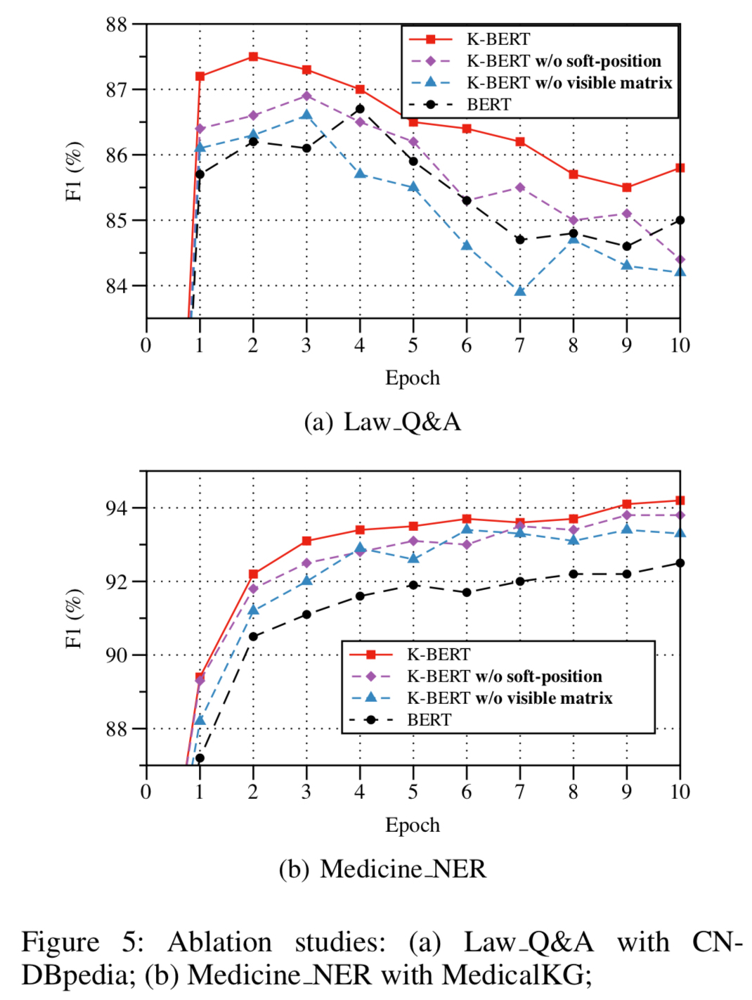

## 0. Abstract

BERT它是一种从大规模语料库中学得语言表征的模型，但是，在专业领域表现不佳。为了解决该问题，作者提出了一个基于知识图谱的语言表示模型K-BERT.

但是，过多的考虑领域知识可能导致语句语义出现错误，这个问题被称为知识噪声（Knowledge noies, KN）。为了解决KN问题，K-BERT引入了soft-position和可视化矩阵(visible matrix)来限制领域知识的影响。

## 1. Introduction

BERT是基于大规模开放预料的预训练模型，对于下游任务，只需微调就可吸收专业领域知识。但是由于预训练和微调之间存在领域知识差异，因而在领域知识驱动型任务上，BERT无法取得满意的表现。

一种解决办法就是基于领域知识的语料库进行预训练，但是这样做耗时耗力，对大多数用户是不能承受的。

因此作者认为**引入知识图谱来使得模型成为领域专家**是一个很好的解决方案，因为：

1. 很多领域的知识图谱都是结构化数据；
2. 在减小预训练成本的同时还能将领域知识植入模型；
3. 模型有更好的可解释性，因为植入的知识是可手工编辑的。

但是，这种方法面临2个挑战：

- **Heterogeneous Embedding Space (HES)**

  即文本中的词嵌入向量和从知识图谱中实体的词嵌入向量，它们的向量空间不一致。

- **Knowledge Noise (KN)**

  过多的考虑领域知识可能导致句子的语义出现错误。

于是作者提出了K-BERT模型，K-BERT可以加载任意BERT模型，然后很容易植入领域知识，而不需要在进行预训练。

## 2. 相关工作

随着2018年Google推出BERT模型，很多人从预训练过程和编码器两方面进行了优化，具体列举如下：

- **对预训练过程的优化**
  - Baidu-ERNIE和BERT-WWM：在中文语料库上对全词掩码，而不是对单个字进行掩码训练了BERT.
  - SpanBERT：通过对连续的随机跨度的词进行掩码，并提出了跨度边界目标
  - RoBERTa：主要通过三个方面对BERT的预训练过程进行了优化，i）删除了预测下一句的训练目标；2）动态掩码策略；3）采用更长的语句作为训练样本
- **对编码器的优化**
  - XLNet：用Transformer-XL替代Transformer，改进对长句子的处理；
  - THU-ERNIE：修改了BERT的编码器，实现单词和实体的相互集成。

另一方面，知识图谱与词向量结合的研究早在预训练LR(Language Representation)模型之前就有人在做了：

> 1. Wang et al. (2014)基于word2vec(Mikolov et al. 2013)的思想提出了一种将实体和单词联合嵌入同一连续向量空间的新方法;
> 2. Toutanova et al. (2015)提出了一个模型，该模型捕获文本关系的组成结构，并以联合方式优化实体，知识库和文本关系表示;
> 3. Han, Liu, and Sun (2016) 用CNN和KG学习文本和知识的联合表示；
> 4. Cao et al. (2018) 利用注意力远程监督方法学习词和实体的跨语言表示。

上述方法的主要缺点是：

> 1. 这些方法是基于"word2vec + transE"的思想，而不是预训练语言表示模型；
> 2. 仍然存在HES(Heterogeneous Embedding Space)问题；
> 3. 实体太多，超出了GPU的内存大小，无法计算。

## 3. K-BERT模型

### 3.1 符号说明

1. $s=\left\{w_{0}, w_{1}, w_{2}, \dots, w_{n}\right\}$  表示一句话，$n$表示语句长度，对于英文是词级别的，对于中文是字级别的；
2. $\mathbb{V}$ ：字典，所有的$w_{i} \in \mathbb{V}$
3. $\mathbb{K}$：知识图谱，是所有三元组$\varepsilon$的集合；
4. $\varepsilon=\left(w_{i}, r_{j}, w_{k}\right)$：一个三元组，$\varepsilon \in \mathbb{K}$

### 3.2 模型架构

K-BERT的模型结构如下图所示：

模型结构包含如下4层：

1. Knowledge layer
2. Embedding layer
3. Seeing layer
4. Mask-Transformer Encoder

### 3.3 Knowledge layer

Knowledge layer(KL)的作用是1)将知识图谱注入到句子中；2)完成句子树的转换。

给定知识图谱$\mathbb{K}$，输入一句话$s=\left\{w_{0}, w_{1}, w_{2}, \dots, w_{n}\right\}$，经KL层后输出句子树$t=\left\{w_{0}, w_{1}, \ldots, w_{i}\left\{\left(r_{i 0}, w_{i 0}\right), \ldots,\left(r_{i k}, w_{i k}\right)\right\}, \ldots, w_{n}\right\}$

该过程分为两步：知识查询（K-Query）和知识注入（K-Inject）

- K-Query

  针对句子中的所有实体，都查询一遍KG：
  $$
  E=K_{-} Q u e r y(s, \mathbb{K}) \tag{1}
  $$
  其中，$E=\left\{\left(w_{i}, r_{i 0}, w_{i 0}\right), \ldots,\left(w_{i}, r_{i k}, w_{i k}\right)\right\}$

- K-Inject

  注入知识生成句子树的过程如下图所示：

  

公式化表示为：
$$
t=K_{-}{Inject}(s, E) \tag{2}
$$

### 3.4 Embedding layer

Embedding layer(EL)的作用是将句子树转换成嵌入表达。和BERT一样，K-BERT的嵌入表示包括三部分：token embedding, position embedding 和 segment embedding。**关键是如何将句子树转换成一个序列，同时保留它的结构信息。**

- **Token Embedding**

  基本操作和BERT一致，因为K-BERT的输入是句子树，所以需要对句子树转换成一个序列，作者的做法是：**直接将句子树的分子插入到对应的节点**，示意图如下：

  

  这种简单的处理使得句子失去了其结构信息，作者通过soft-position和visible matrix解决该问题。

- **Soft-position embedding**

  我们知道，BERT引入position embedding是为了建模句子的结构信息(比如词序的影响)。因此作者用所谓的soft-position embedding来解决句子树重排序后导致句子不通顺的问题。

  Soft-position embedding的位置编码示例见图2.

  从图2可以看到，存在位置不同编码相同的问题，作者的解决办法是所谓的Mask-Self-Attention，见后文。

- **Segment embedding**

  与BERT一致，见图2.

### 3.5 Seeing layer

Seeing layer是K-BERT和BERT的最大区别，也是本文方法有效的关键！

前文已经讲了引入KG可能造成KN问题，于是Seeing layer层的作用就是通过一个visible matrix来限制词与词之间的联系。

visible matrix $M$的定义如下：
$$
M_{i j}=\left\{\begin{array}{cl}
0 & w_{i} \ominus w_{j} \\
-\infty & w_{i} \oslash w_{j}
\end{array}\right. \tag{3}
$$
$w_{i} \ominus w_{j}$ 表示两个词在同一支路上；$w_{i} \oslash w_{j}$ 表示两个词不在同一支路上。$i$ 和 $j$ 是hard-position index.

**Note:** soft-position index 和 hard-position index 见图2.

### 3.6 Mask-Transformer

因为Transformer的编码器不能接收visible matrix作为输入，因此作者对其进行了改造，称为Mask-Transformer.所谓Mask-Transformer，其实就是**mask-self-attention**块的堆叠。

符号定义同BERT：

- $L$ —— mask-self-attention块的个数；

- $H$——hidden size
- $A$ —— mask-self-attention header的个数

**Mask-Self-Attention**

Mask-Self-Attention的数学定义如下：
$$
\begin{eqnarray*}
Q^{i+1}, K^{i+1}, V^{i+1} &=& h^{i} W_{q}, h^{i} W_{k}, h^{i} W_{v} \tag{4} \\
S^{i+1}&=&\operatorname{softmax}\left(\frac{Q^{i+1} K^{i+1^{\top}}+M}{\sqrt{d_{k}}}\right) \tag{5} \\
h^{i+1}&=&S^{i+1} V^{i+1} \tag{6}
\end{eqnarray*}
$$
其中：

> 1. $W_{q},W_{k},W_{v}$ 是需要学习的模型参数；
> 2. $h^{i}$：隐状态的第$i$ 个mask-self-attention块；
> 3. $d_{k}$：缩放因子；
> 4. $M$：visible matrix；

如果$w_{k}$ 对$w_{j}$ 不可见，则$M_{jk}=- \infty$ ，从而注意力$S^{i+1}=0$.

Mask-Transformer的实体图如下：

从上图可以看到，$h_{[Apple]}^{i}$ 对$h_{[CLS]}^{i+1}$ 是不可见的。但是$h_{[Apple]}^{i+1}$是可以间接影响到 $h_{[CLS]}^{i+1}$的。

## 4. 实验

作者在12个中文NLP任务上对K-BERT进行了测试。

### 4.1 训练预料

- **WikiZh**
- **WebtextZh：**一个高质量的、大规模的中文问答预料库。

### 4.2 KGs

- **CN-DBpedia：**包含5.17条三元组；
- **HowNet：**
- **MedicalKG：**作者自己开发的中文医疗领域的知识图谱。

### 4.3 Baselines

- **Google BERT：**Google基于WikiZh预料库训练的BERT；
- **Our-BERT：**作者用WikiZh和WebtextZh两个语料库训练的BERT

### 4.4 参数设置和训练细节

为了反应KG和RL(Representation Language)模型之间的角色关系，作者在训练X-BERT时保持与BERT的参数一致。

1. (mask-)self-attention的层数$L=12$;
2. (mask-)self-attention的多头数$A=12$;
3. 隐层向量维度$H=768$

需要说明的是：在训练K-BERT时并不会加入KG。因为KG会将相关的两个实体绑定在一起，从而训练时被掩码的两个词意思相近或相等，从而导致语义损失？？KG是在接下游任务微调时或推理时加入的。

### 4.5 开放域的任务

在开放域的8个中文NLP任务上对Google BERT和K-BERT做了比较，结果如下表：

总结如下：

1. 对于情感分析任务，KG的帮助不大。因为根据语句中的情感词本身就能做出情感判断；
2. 对于语义相似任务（XNLI，LCQMC），语义知识图谱（HowNet）的帮助更大；
3. 对于Q&A和NER任务（NLPCC-DBQA and MSRA-NER），有更多知识的KG比语言知识图谱更有帮助，见表2；

### 4.6 专业领域的任务

作者分别在金融、法律和医学领域的NLP任务做了测试，见下表：

引入KG确实能带来效果的提升，尤其是医学领域的提升比较明显。

### 4.7 变量消除研究

这一节作者主要对soft-position-index和visible matrix的效果进行了变量消除研究，结果如下图所示：

符号说明：

- **w/o soft-position:** 微调时使用hard-position，而不是soft-position;
- **w/o visible matrix：**所有token之间都是可见的。

作者总结实验结果如下：

（1）消除soft-position或visible matrix的任何一项，效果都不及K-BERT；

（2）在Law_Q&A任务中，没有visible matrix的K-BERT的效果比BERT还差，证明了KN(Knowledge noise)问题的存在；

（3）在Law_Q&A任务中，K-BERT的收敛速度比BERT快。

## 5. 结论

作者将KG中的知识注入句子中，通过soft-postion-index和visible matrix控制知识的可见范围。实验怎么KG确实对知识驱动的专业领域任务有帮助。另外因为K-BERT可以做到和BERT参数共享，因此免去了K-BERT的预训练。

改进方向：

（1）查询知识时过滤掉一些不重要的知识；

（2）将方法拓展到其它语言模型。

