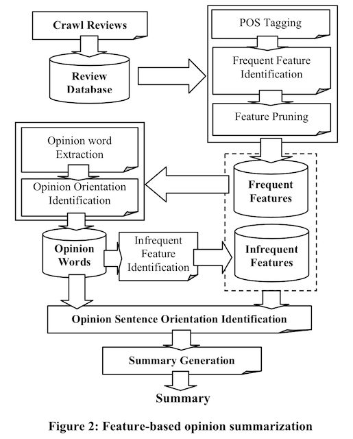
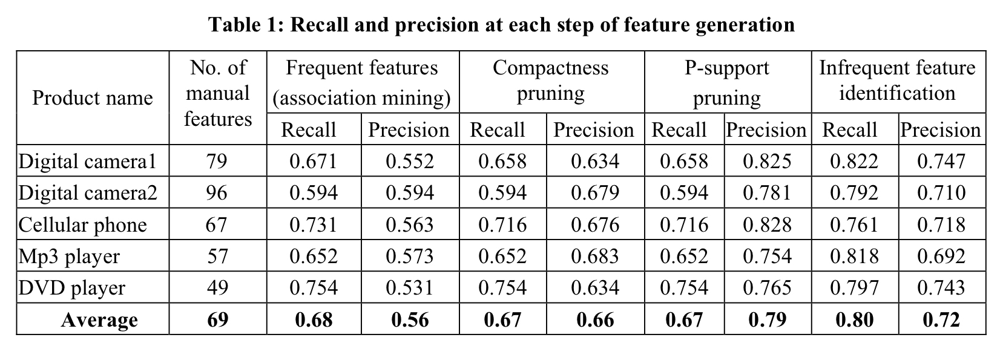

### Mining and Summarizing Customer Reviews论文总结

论文标题：Mining and Summarizing Customer Reviews

作者：Minqing Hu, Bing Liu

出版源：Proceedings of the tenth ACM SIGKDD international conference on Knowledge discovery and data mining（2004）


## 1. Introduction

虽然现在任何一个电商平台都会对用户评价做一定处理，但在作者发表论文的哪个时候，应该是块空白。

用户对商品的评价对潜在客户和产品生厂商都有很大的帮助，所以作者旨在构建一个系统挖掘和总结顾客对产品的评价。


作者提出的方法主要流程可拆解为以下三步：

1. 商品特性的挖掘，主要用到数据挖掘和NLP技术；
2. 识别表名顾客态度倾向的语句（opinion sentences），并判断其观点是正面的还是负面的，这又分3小步：
   1. 用NLP技术找到评论中的所有形容词（因为形容词最有可能表达用户的态度倾向），作者把这些词称为`opinion words`;
   2. 对每一个`opinion word`，从语义上判断其正面/负面意义，用到的技术有Booststrapping和WordNet;
   3. 判断每句话在态度上的倾向性。
3. 对以上结果做结构化的汇总。


## 2. 技术详解

整体的技术系统结构如下图所示：

输入：商品名和商品评价页；

输出：结构化的总结



### 2.1 词性标注

论文采用NLProcessor linguistic parser分割评论得到每个单词得词性标注。

因为一般用名词或名词短语来表达商品属性，因此，只存储名词和名词短语。

当然，也要做些预处理，比如去掉停用词，词干和模糊匹配等。


### 2.2 识别高频属性

这里只抽取评论中的显示表达的商品属性，比如：

> "*while light, it will not easily fit in pockets.*"
>
> 虽然顾客想表达相机的size，但因为size没有出现在语句中，所以相机的size属性不予考虑。


论文采用association mining来挖掘高频词/短语，同时对特征出现的频率设定了一个阈值1%。


根据上面的算法得到的候选高频属性并不一定是真正的商品属性，作者用了两种方式过滤掉不太可能得特征：

**1. Compactness pruning**

这个方法主要是检查至少含有2个单词得特征短语（*feature phrases*），然后去掉哪些没意义的特征短语。

这种无意义的特征短语产生的原因是association mining算法没有考虑单词在语句中的位置顺序。

具体的处理方法在作者的另一篇论文中做了描述（Hu, M., and Liu, B. 2004. Mining Opinion Features in Customer Reviews. To appear in AAAI’04, 2004.）


**2. Redundancy pruning**

这个方法主要是对单个单词描述的特征进行剪枝。

作者用所谓的*`p-support`*对属性进行剪枝，关于*`p-support`*的计算，举例如下：

> Sentance1：The battery life is good
>
> Sentance2：My life is good
>
> 
>
> 第一个句子包含battery、 battery life、 life三个名词
>
> 第二句子包含life一个名词。
>
> 
>
> 在计算life的p-support时，因为battery life是life的超集，所以第一句不计算life的p-support，所以life的p-support为1

如果一个属性的*`p-support`*小于3，且这个属性出现在别的属性短语中，则去掉这个属性。


### 2.3 观点词抽取

已有人证明了语句所表达的主观性与形容词有很重要的联系。所以作者使用形容词作为观点词（opinion words）。


- 观点语句（opinion sentence）

  一个语句至少包含一个商品特征和顾客观点的词称为观点语句（opinion sentence）
  
- 观点词（opinion word）

  作者将句子中的形容词作为opinion word

- 有效观点词（effective opinion）

  离名词/名词短语最近的形容词称为effective opinion，它在判断语句的情感时有特别的用处（见2.6节）


观点词的抽取伪代码：

```python
for each sentence in the review database:
	if (it contains a frequent feature, extract all the adjective words as opinion words)
		for each feature in the sentence:
			the nearby adjective is recorded as its effective opinion
```


### 2.4 观点词的情感判断

对提取到的每一个观点词（opinion word），需要判断其是正面情感还是负面情感。


作者认为，同意词之间的情感是一样的；对应地，它的所有反义词的情感正好与之相反。于是，作者利用WordNet提出了一个简单又高效的做法：

1. 首选手动选择一系列的形容词作为seed. 当然这些作为seed的形容的情感是预先就知道的；
2. 遍历所有的观点词（opinion words）,通过WordNet来搜索其同义词和反义词，如果搜索到了，则将其加入seed中。
3. 没有配到到的观点词（opinion word）则舍弃掉（当然也可以人为判断，重新加入seed中）


伪代码如下：

```c++
Procedure OrientationPrediction(adjective_list, seed_list) 
begin
	do {
		size1 = # of words in seed_list; 
    OrientationSearch(adjective_list, seed_list); 
    size2 = # of words in seed_list;
	} while (size1 ≠ size2); 
end
  
Procedure OrientationSearch(adjective_list, seed_list) 
begin
	for each adjective wi in adjective_list 
  begin
    # 搜索到同义词
		if (wi has synonym s in seed_list){ 
      wi’s orientation= s’s orientation; 
      add wi with orientation to seed_list; 
    }
		# 搜索到反义词
		else if (wi has antonym a in seed_list){ 
      wi’s orientation = opposite orientation of a’s orientation;
			add wi with orientation to seed_list; 
    }
	endfor; 
end
```


### 2.5 识别低频特征

有些低频特征（infrequent feature）很少有用户提到，但这些特征可能也是有用的。在3.2节中作者到association mining提取高频特征，但association mining无法识别这些低频特征。（==为什么？==）


作者用到的提取方法也很简单，通过3.3节中提取到的观点词（opinion word）找附近的名词，伪代码如下：

```c++
for each sentence in the review database
	if (it contains no frequent feature but one or more opinionwords){ 
    find the nearest noun/noun phrase around the opinion word. 
    The noun/noun phrase is stored in the feature set as an infrequent feature. 
  }
```


她的这个方法可能会提取到一些与产品属性无关的名词/名词短语，但是问题不大，因为它们所占的比例很小。


### 2.6 句子的情感判断

有了产品特征（product feature）和观点词（opinion word），可以判断句子的情感了。


作者的做法是通过句子中占主要的观点词决定：

1. 如果句子中某个维度的正面/负面观点词占主要，那么评论就对应为正面/负面；
2. 如果正面/负面的观点词一样多，则通过*`effective opinion`*或前一句的情感进行判断；
3. 同时考虑转折词，否定词对情感的影响。


伪代码如下：

```python
# 句子情感判断
Procedure SentenceOrietation() 
begin
	for each opinion sentence si 
  begin
		orientation = 0;
		for each opinion word op in si
			orientation += wordOrientation(op, si);
			/*Positive = 1, Negative = -1, Neutral = 0*/
		if (orientation > 0) 
    	si’s orientation = Positive;
		else if (orientation < 0) 
    	si’s orientation = Negative;
		else {
			for each feature f in si
				orientation += wordOrientation(f’s effective opinion, si); 
      if (orientation > 0)
				si’s orientation = Positive; 
      else if (orientation < 0)
				si’s orientation = Negative;
			else 
      	si’s orientation = si-1’s orientation;
		} 
	endfor;
end

# 词性判断
Procedure wordOrientation(word, sentence) 
begin
	orientation = orientation of word in seed_list;
  # 考虑了否定词，翻转情感
	If (there is NEGATION_WORD appears closely around word in sentence) 
  	orientation = Opposite(orientation);
end
```


### 2.7 信息汇总

信息汇总的步骤如下：

1. 对给定的商品属性，对其关联的情感语句分成正面/负面两类，然后分别统计数量；
2. 对商品属性在评论中出现的频率进行排序。


## 3. 实验部分

对特征提取的每一步统计了召回率和查准率，如下表所示：



实验结果说明：

1. 使用association mining提取出来的特征，查准率和查全率偏低，说明有很多错误的特征被提取；
2. 通过Compactness pruning和P-support pruning后，查准率有了提高，但查全率基本没啥变化；
3. 通过低频特征识别步骤后，查全率提升了，但查准率稍有下降，但影响不大，因为这些属性在排序时是排在靠后位置的，对大多数用户没有影响。


为了对比作者提出的方法，然后作者使用FASTR提取特征，其查准率和查全率如下表：


可以看到，查准率和查全率都显著比作者提出的方法低，原因大致两点：

1. FASTR提取到的特征太多了，有很多都跟产品本身没有关系；
2. FASTR只提取单词短语，不考虑单个单词情况。


最后，作者又对情感语句的提取和语句情感判断结果做了分析，见下表：


对实验结果，作者做了如下两点总结：

1. 情感语句提取的查准率偏低，作者认为是标注人员的标注比较严格造成的；
2. 从最终的效果来看，系统的精度还是相当高的。


## 4. 总结

作者为了挖掘和分析商品的用户评价，构建了一个所谓的FBS(Feature-Based Summarization)系统，然后对每一步做了详尽的说明，最终实验结果表明该系统还是很高效的。


需要改进的地方有：

1. 商品特征提取时没有考虑代词，比如*it*；
2. 情感词提取时没有考虑动词和名词，只使用了形容词；
3. 还不能区分用户观点的强弱程度。
