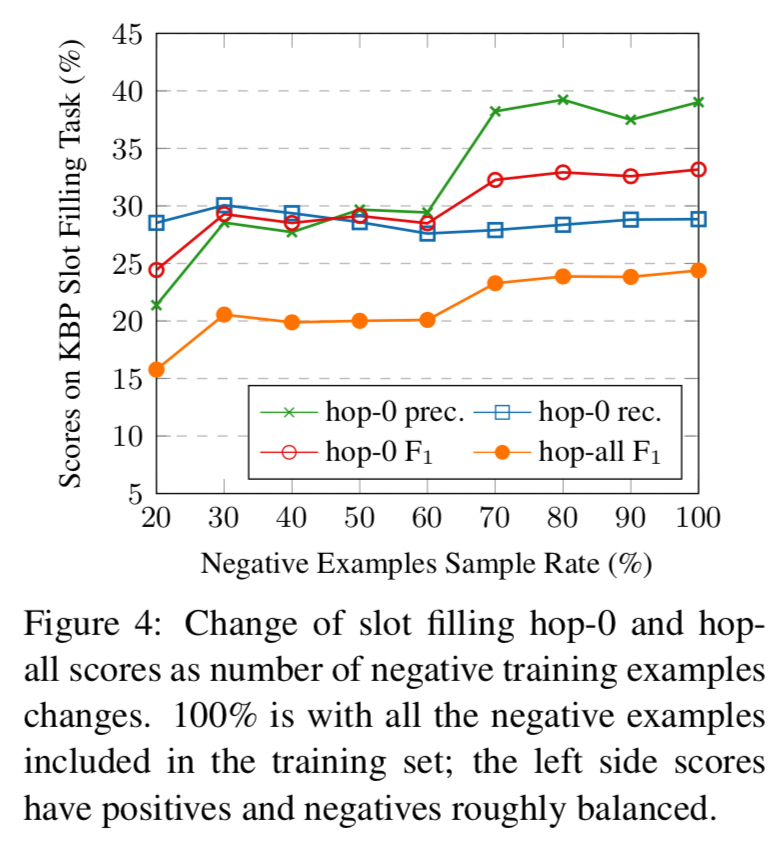

论文题目：Position-aware Attention and Supervised Data Improve Slot Filling

发表作者：Yuhao Zhang, Victor Zhong, Danqi Chen, Gabor Angeli, Christopher D. Manning

出版源：Proceedings of the 2017 Conference on Empirical Methods in Natural Language Processing, pages 35–45

## Abstract

从文档中自动提取知识构建知识图谱发展很慢。作者做了两方面的工作：

1. 提出了一个新的模型，结合了LSTM和实体位置感知的注意力机制；
2. 同时，构建了一个包含了TAC KBP评测中常见关系的监督训练数据集——TAC关系抽取数据集（TACRED）。

## 1. Introduction

从一段文本中提取知识，从而构建实体关系的知识图谱。这个任务包含实体识别、指代关联、实体连接。作者关注的是最具挑战的"Slot filling"任务，即填充文本中实体之间的关系。

相似工作有：

1. [Zelenko et al., 2003](http://jmlr.csail.mit.edu/papers/volume3/zelenko03a/zelenko03a.pdf) *Kernel Methods for Relation Extraction*
2. [Mintz et al., 2009](https://nlp.stanford.edu/pubs/mintz09.pdf) *Distant supervision for relation extrac- tion without labeled data*
3. [Adel et al., 2016](https://www.aclweb.org/anthology/N16-1097.pdf) *Comparing convolutional neural networks to traditional models for slot filling.*

但他们的工作并没有达到足够的召回率和精确度。

同时，有标签的训练数据是很稀缺的，远程监督技术可以扩充训练数据，但它容易产生噪声数据。

作者分析没有可靠的方法的原因：

（1）过往使用的模型并不能很好适用于信息提取任务；

（2）缺少训练数据，尤其是深度学习这样需要足够多样本的模型

针对上述两个问题，作者做了两方面工作：

- 提出了一个新的，用于关系分类的神经网络序列模型。它的结构更适应槽位填充任务：因为词的分布式表示考虑了词的位置关系。

- 另外 ，用众包的方式，生成了大量的标注数据，作者将这个数据集命名为TAC Relation Extraction Dataset (TACRED)

## 2. 关系提取的位置感知神经序列模型

已经有人用CNNs或RNNs或它们的组合方式去做知识提取任务，但这些模型对于长句子（真实文本中长句子是很常见的）的泛化能力较弱。

作者分析现有模型遭遇的问题：

（1）尽管现在的序列模型，比如LSTM等采用门控机制（gating mechanisms）通过控制个体单词之间的相互影响最终对句子的表示产生影响，但这种控制无法作用到整个句子；

（2）这些模型没有显式对实体位置进行建模，或只建模了局部区域的位置信息。

本文作者在LSTM模型的基础上引入了位置注意力机制，从而可以：

（1）模型看完整个语句后评估各个词之间的相互贡献；

（2）这种评估不仅考虑了序列的语义，还对实体的全局位置信息加以考虑。

下面对作者的模型进行说明：

1. $\mathcal{X}=\left[x_{1}, \ldots, x_{n}\right]$

   表示语句，$x_{i}$ 表示第$i$ 个token

2. $\mathcal{X}_{s}=\left[x_{s_{1}}, x_{s_{1}+1}, \ldots, x_{s_{2}}\right]$

   主实体(subject entity)

3. $\mathcal{X}_{o}=\left[x_{o_{1}}, x_{o_{1}+1}, \ldots, x_{o_{2}}\right]$

   从实体(object entity)

4. $\left[p_{1}^{s}, \ldots, p_{n}^{s}\right]$

   相对主实体$s$ 的位置序列，定义为：
   $$
   p_{i}^{s}=\left\{\begin{array}{ll}
   i-s_{1}, & i<s_{1} \\
   0, & s_{1} \leq i \leq s_{2} \\
   i-s_{2}, & i>s_{2} \tag{1}
   \end{array}\right.
   $$
   $s_{1}$, $s_{2}$ 分别表示实体的首尾位置索引。

5. $\left[p_{1}^{o}, \ldots, p_{n}^{o}\right]$

   相对从实体$o$ 的位置序列

6. $\mathbf{x}=\left[\mathbf{x}_{1}, \ldots, \mathbf{x}_{n}\right]$ 

   句子的词向量表示，通过词嵌入句子$\mathbf{E}$获取

7. $\mathbf{p}^{s}=\left[\mathbf{p}_{1}^{s}, \ldots, \mathbf{p}_{n}^{s}\right] \text { and } \mathbf{p}^{o}=\left[\mathbf{p}_{1}^{o}, \ldots, \mathbf{p}_{n}^{o}\right]$

   位置嵌入向量，通过位置嵌入矩阵$\mathbf{P}$获取

训练的任务是：给定一个语句$\mathcal{X}$和实体位置$s$和$o$ ，要预测实体之间的关系$r$，$r$要么属于$\mathcal{R}$（$\mathcal{R}$实体间关系的集合），要么实体间不存在任何关系。

模型结构如下图所示：

$$
\left\{\mathbf{h}_{1}, \ldots, \mathbf{h}_{n}\right\}=\operatorname{LSTM}\left(\left\{\mathbf{x}_{1}, \ldots, \mathbf{x}_{n}\right\}\right) \tag{2}
$$
定义$\mathbf{q}=\mathbf{h}_{n}$ 表示整个语句的信息 ，基于每个隐状态$\mathbf{h}_{i}$，计算其attention：
$$
\begin{eqnarray}
u_{i} & = & \mathbf{v}^{\top} \tanh \left(\mathbf{W}_{h} \mathbf{h}_{i}+\mathbf{W}_{q} \mathbf{q}+\right.
\left.\mathbf{W}_{s} \mathbf{p}_{i}^{s}+\mathbf{W}_{o} \mathbf{p}_{i}^{o}\right) \tag{3} \\
a_{i} & = & \frac{\exp \left(u_{i}\right)}{\sum_{j  =  1}^{n} \exp \left(u_{j}\right)} \tag{4}
\end{eqnarray}
$$
其中：

- $\mathbf{W}_{h}, \mathbf{W}_{q} \in \mathbb{R}^{d_{a} \times d}$
- $\mathbf{W}_{s}, \mathbf{W}_{o} \in \mathbb{R}^{d_{a} \times d_{p}}$
- $\mathbf{v} \in \mathbb{R}^{d_{a}}$
- $d$ —— 隐藏层单元维度
- $d_{p}$ —— 位置嵌入向量维度
- $d_{a}$ —— Attention层单元维度
- $\mathbf{E} \in \mathbb{R} ^{|\mathcal{V}| \times d}$ —— 词嵌入矩阵，$\mathcal{V}$ 表示字典
- $\mathbf{P} \in \mathbb{R}^{(2 L-1) \times d_{p}}$ —— 位置嵌入矩阵，$L$ 最大句长

注意力$a_{i}$可以看做是特定单词对句向量的贡献，最终句向量可表示为：
$$
\mathbf{z}=\sum_{i=1}^{n} a_{i} \mathbf{h}_{i} \tag{5}
$$
得到$\mathbf{z}$后，将$\mathbf{z}$喂给一个全连接层，并接上Softmax层预测关系分类。

对比Bahdanau et al. (2015)和Zhou et al. (2016) 提出的注意力模型，作者认为自己模型与他们模型的最大区别是：在计算注意力权值时用到了概要向量$\mathbf{q}$和位置嵌入$\mathbf{p}$。

对模型的理解：

1. 对注意力$a_{i}$的计算可以看做是从文本中挑选相关内容而摒弃无关内容；

2. 概要向量$\mathbf{q}$帮助模型基于整个语句的语义信息选取相关内容；
3. 位置向量$\mathbf{p}_{i}^{s}$，$\mathbf{p}_{i}^{o}$ 提供了词和实体之间的空间位置信息

## 3. TAC关系提取数据集

已有研究表明，监督数据对于槽位填充(slot filling)系统大有裨益。但是现有的关系提取数据集，比如SemEval-2010 Task 8 dataset 以及Automatic Content Extraction (ACE)  对这样的任务却帮助不大，作者分析原因如下：

（1）这些数据集相对较小，表2给出了对比；

（2）它们捕捉的关系与我们的需求不太一致。

一种可以方便获取大量训练数据集的方法是使用远程监督自动构建训练数据集。但是在实际使用中，远程监督会产生大量噪声数据。为了解决上述问题，作者收集了一个大型数据集，取名为TACRED（TAC Relation Extraction Dataset 

- **数据收集**

作者用到了2009~2015年间TAC KBP评测任务的查询实体（年均100个实体名，包含人名和组织机构名）以及系统的输出实体及它们之间的关系。同时，作者利用Mechanical Turk让众包人员对语料库中的实体及关系进行标注。

- **数据子集划分**

作者共采集到119474个样本，作者根据年限划分为训练集、开发集和测试集，详细统计见下表：

- **探讨**

下表是从TACRED数据集采样的几个样本：

作者总结了TACRED的4点优势：

1. 从表2可以看到，TACRED数据集包含的关系实例相较另外两个数据集，多了一个数量级；
2. 用到了TAC KBP任务的实体和关系类型，作者任务这样的实体关系类型对于下游应用是有帮助的；
3. 我们对所有负样本进行了标注，因此基于TACRED数据训练的模型，在预测真实文本时不会偏向预测为假阳性；
4. TACRED数据集中语句的平均长度是36.2，相较SemEval数据集的19.1，TACRED数据集更能体现真实文本中实体间的复杂关系。

## 4. 实验

为了验证作者提出的模型以及数据集TACRED，作者分别做了两组实验：

（1）用TACRED评估模型在信息提取任务上的表现；

（2）对基于TACRED训练的模型，评估其在TAC KBP 2015 cold start slot filling任务上的表现。

### 4.1 基线模型

- TAC KBP 2015年度获胜系统

  该系统的核心包含两个关系提取器：一个基于模式的提取器和一个逻辑回归分类器。

- CNNs

  Nguyen and Grishman (2015)构建了一个一维CNN网络用于关系提取。同时他们也引入了位置嵌入（position embedding），作者把他们这种引入位置嵌入的CNN网络称为“CNN-PE”.

- 最短依存路径RNN

  Xu et al. (2015b)提出了一个叫“SDP-LSTM”的模型，它将主实体（subject entity）和从实体（object  entity）到最低共同祖节点的路径分别喂给LSTM网络，让后经过最大池化层后拼接在一起构成最终表示。

  同时，作者也把无位置Attention的LSTM模型作为基线模型。

### 4.2 实现细节

1. 训练集中出现频数小于2的单词设为特殊标记$<UNK>$;
2. 用了GloVe词嵌入；
3. 用的是两层的LSTMs，作者对比发现要比一层LSTMs效果更好；
4. 用交叉熵作为损失函数，用AdaGrad优化损失函数；
5. 对LSTMs和CNNs均施行了Dropout（rate=0.5）;
6. 同时对单词也进行了Dropout，即随机将部分单词设置为$<UNK>$;

- **实体掩码（Entity Masking）**

  将原始语句中的主实体替换为$\langle NER\rangle-SUBJ$，其中$\langle NER\rangle$ 对应TACRED中的命名实体签名。同样地对从实体进行替换。作者认为这样做有两点好处：

  （1）可以提供实体类型信息；

  （2）避免过拟合

  

- **多通道增强（Multi-channel augmentation ）**

  除了将词向量作为输入，同时还将POS和NER Embedding作为输入。

### 4.3 在TACRED数据集上的评测

作者对各个模型都进行了5次训练，在开发集上做了早停，然后进行比较:

通过比较分析，可以发现：

1. 神经网络模型的$F_{1}$确实要比逻辑回归和模型系统高；
2. 对于纯CNN模型，引入位置嵌入，$F_{1}$能提高$2\%$左右；

3. 我们的模型要比所有的基线模型都要好；通过集成的方式，$F_{1}$还能提高；

同时，发现不同神经网络模型 ，它们的查准率和召回率有不同的侧重。基于CNN的模型相对有更高的查准率，而基于RNN的模型有相对更高的召回率。则可以简单理解为CNN的卷积核相当于是一种N-Gram模式。

### 4.4 在TAC KBP槽位填充任务上的测评

作者用各个模型在TAC KBP2015冷启动槽位填充任务上进行了测试。

该任务是给定一个查询实体，第一步根据给定关系找出查询实体对应的从实体，称为**hop-0 slot**；第二步，将第一步的输出作为查询实体，然后找到对应的从实体，称为**hop-1 slot**.

对信息提取系统的槽位填充任务的评测面临两个挑战：

1. 系统得分综合了系统各个模块的表现（比如：实体识别 、实体连接和关系提取）；
2. hop-0 slot的错误会传导到hop-1 slot.

为了公平评测关系提取模块，作者用斯坦福的参赛系统作为基础pipeline，然后在它的基础上加上关系抽取模块，保持其他模块不变。

评测结果见下表：

对结果分析可得：

（1）在TACRED上训练的LR模型结合模式，$\text{hop-0 } F_{1}$要比斯坦福参赛系统高，但hop-all $F_{1}$得分要低些；

（2）作者提出的位置感知注意力模型在Hop-0 slot、Hop-1 slot以及Hop-all slot上的得分都要比当时最优系统的得分要高；如果与模式相结合，效果更好！

### 4.5 分析

**1. Model ablation**

下表展示了模型在TACRED数据集上的分解测试结果，结果表明Attention机制贡献了1.5%的$F_{1}$提升。

**2. 负样本的影响**

作者探讨了负样本数量对模型的影响，实验结果见下图：

通过曲线走势可以看出：

（1）对于hop-0，随着负样本的增加，准确率不断上升，但召回率变化不大，$F_{1}$也上升；

（2）对于hop-all，负样本的数量从20%升到100%，$F_{1}$提升了约10%。

**3. 句长影响**

下图展示了句长对模型的影响：

（1）随着句子变长，所有模型的效果都会下降；

（2）相比LR模型，所有的神经网络模型对于长句子表现更好；

（3）相比CNN-PE模型，基于RNN的模型对于长句子更具鲁棒性，同时SDP-LSTM模型对句长不那么敏感；

（4）作者提出的模型，除了超过60个单词长的语句，表现都很好。

**4. 注意力可视化**

下图是注意力的一个可视化结果。从图中可以看到，模型会对哪些对关系有指向性的词更多的注意力。同时，模型会对哪些目标实体（Object entity）更多注意力。

## 5. 结论

结论本文提出了一个用于关系抽取的认知位置的神经序列模型，以及一个大规模、多来源、显著提升关系实例数的数据集——TACRED。二者相结合，在冷启动槽填充评测中可以提升约4.5%的$F_{1}$值。

