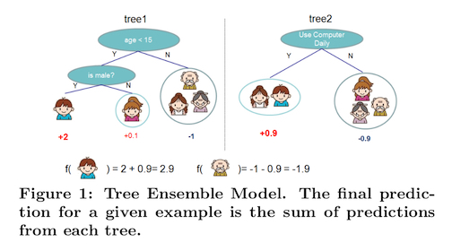
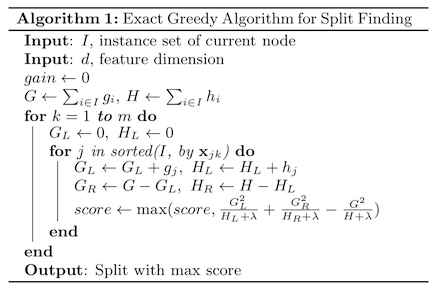
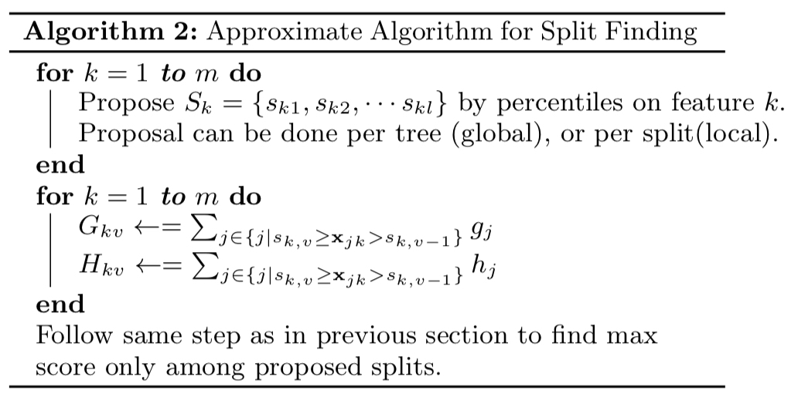
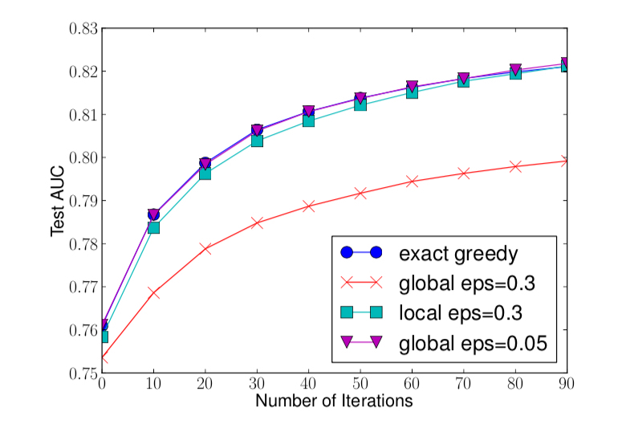
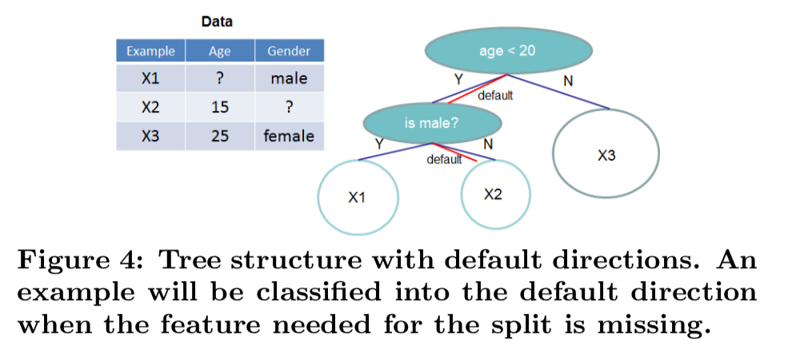
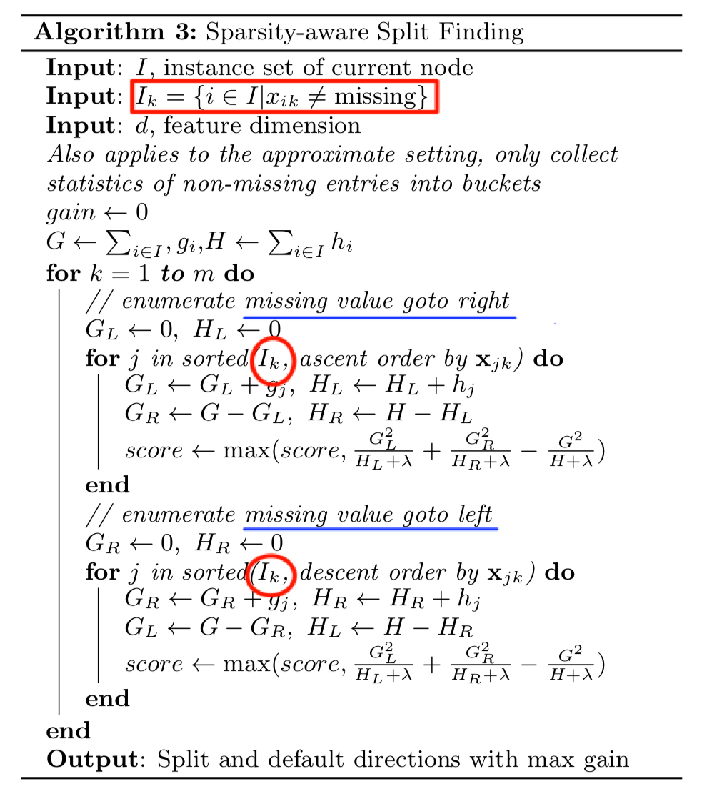
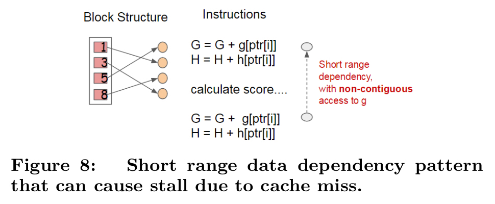
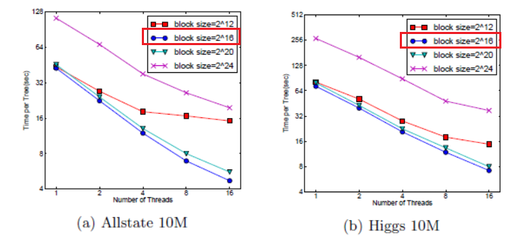

# XGBoost: A Scalable Tree Boosting System

论文题目：XGBoost: A Scalable Tree Boosting System

作者：Tianqi Chen, Carlos Guestrin

文章发表于SIGKDD 2016大会

## 1. Introduction

XGBoost是Extreme Gradient Boosting的缩写，它是基于决策树的集成机器学习算法，它以梯度提升为框架，由GBDT发展而来，但在算法本身和系统设计上做了很多细致的优化工作，从而实现端到端（end-to-end）、可扩展的提升树系统。主要的贡献和优势有：

1. 设计构建了一个高可扩展的端到端提升树系统；
2. 提出了理论上合理的加权分位数略图（Weighted quantile sketch）；
3. 介绍了一个新型的稀疏感知算法，可用于平行学习；
4. 提出了一个高效的缓存感知块结构（cache-aware block structure）

XGBoost在Kaggle和KDDCup等比赛中都要非常优异的表现，是经得起考验的算法。

## 2. XGBoost模型定义、优化目标及优化算法

相比传统的Tree Boosting算法，XGBoost在定义损失函数时引入了正则项。

### 2.1 正则化的学习目标

假设数据集$\mathcal{D}$的大小为$n$，$m$个特征，记为:$\mathcal{D}=\left\{ \left( \mathbf{x}_{ i },y_{ i } \right)  \right\} \left( \left| \mathcal{D} \right| =n,\mathbf{x}_{ i }\in \mathbb{R}^{ m },y_{ i }\in \mathbb{R} \right) $

那么集成树模型可表示为$K$个回归树的叠加：
$$
\hat { y_{ i } } =\phi \left( \mathbf{x}_{ i } \right) =\sum _{ k=1 }^{ K }{ f_{ k }\left( \mathbf{x}_{ i } \right)  } ,\space f_{ k }=\mathcal{F} \tag{ 1 }
$$
其中:

> $\mathcal{F}$是回归树模型空间，$\mathcal{F}={f(\mathbf{x})=w_{q(\mathbf{x})}}$$(q:\mathbb{R}^m \rightarrow T,w \in \mathbb{R}^T)$
>
> $q:$ 代表每科树结构，表示将一个样本分类到对应的叶节点；
>
> $T:$ 每棵树叶节点的个数；
>
> $w:$ 叶节点的权重，$T$维向量，因为Tree Boosting模型的弱学习器用的是回归树，所以采用$w$表示每个叶节点的score。

模型的集成示意图：

模型结构化风险函数定义为：
$$
\begin{split}
\mathcal{L}\left( \phi  \right) =\sum _{ i }{ l\left( \hat { y_{ i } } ,y_{ i } \right)  } +\sum _{ k }{ \Omega \left( f_{ k } \right)  }  \\
where \space \Omega(f) = \gamma T + \frac { 1 }{ 2 }  \lambda { \left\| w \right\|  }^{ 2 } 
\end{split}
\tag{2}
$$
对损失函数的理解：

1. 等式右边第一项为可微的凸损失函数（这里也是作者说可以自定义损失函数的原因，只要保证是可微的、凸函数就ok），因此是对样本求和；

2. 第二项是正则项，与每棵树的结构（叶节点数$T$）和叶节点权重（$w$）有关，因此是对弱回归树求和；
3. 传统的tree boosting算法是没有后面的正则项，所以这里是作者的创新，不过也是参考了Friedman等人的方法。

### 2.2 目标函数的优化求解

怎么去优化损失函数呢？作者采用叠加式模型（additive model） + 泰勒近似对损失函数进行优化。

**Additive Model**

令${ \hat { y }  }_{ i }^{ \left( t \right)  }$是第$t$步迭代第$i$个样本的预测值，因此优化目标函数可写成如下形式：
$$
\mathcal{L}^{(t)} =\sum _{ i }^{n}{ l\left(y_{ i }, \hat { y_{ i }} ^{(t-1)}+f_{t}(\mathbf{x_{i}}) \right)  } +\sum _{ k }{ \Omega \left( f_{ k } \right)  }
$$
回顾泰勒展开公式：$f\left( x+\Delta x \right) \approx f\left( x \right) +f^{ ' }\left( x \right) \cdot \Delta x+\frac { 1 }{ 2 } f^{ 2 }\left( x \right) \cdot { \Delta  }^{ 2 }x$

令：$g_{i}={ \partial  }_{ { \hat { { y }_{ i } }  }^{ \left( t-1 \right)  } }l\left( y_{ i },{ \hat { y } _{ i } }^{ \left( t-1 \right)  } \right) $，$h_{ i }={ \partial  }_{ { \hat { { y }_{ i } }  }^{ \left( t-1 \right)  } }^{ 2 }l\left( y_{ i },{ \hat { y } _{ i } }^{ \left( t-1 \right)  } \right)  $

对上式进行泰勒二阶展开近似，去掉常数项，得到如下目标函数：
$$
\tilde{ \mathcal{ L } }^{ (t) }=\sum _{ i=1 }^{ n }{ \left[ g_{ i }{ f }_{ t }\left( { \mathbf{x} }_{ i } \right) +\frac { 1 }{ 2 } h_{ i }{ f }_{ t }^{ 2 }\left( { \mathbf{x} }_{ i } \right)  \right]  } +\gamma T+\frac { 1 }{ 2 } \lambda \sum _{ k }^{ T }{ { w_{ k } }^{ 2 } } 
\tag{3}
$$
上面的式子第一项是沿样本求和，另一个是沿树求和，统一对子树求和

将叶子节点$j$上的所有样本集合定义为：

$I_{j}=\{i|q(\mathbf{x_{i}})=j\}$

所以式（3）可以统一转化为对树求和：
$$
\tilde{ \mathcal{ L } }^{ (t) }=\sum _{ j=1 }^{ T }{ \left[ \left( \sum _{ i\in I_{ j } }{ g_{ i } }  \right) w_{ j }+\frac { 1 }{ 2 } \left( \sum _{ i\in I_{ j } }{ h_{ i }+\lambda  }  \right) w_{ j }^{ 2 } \right]  } +\gamma T
\tag{4}
$$
为了简化表示，令：$G_{j}=\sum_{i \in I_{j}}g_{i}$，$H_{j}=\sum_{i \in I_{j}}h_{i}$

式（4）对$w_{j}$求导，可得到最佳的$w_{j}^{*}$：
$$
w_{ j }^{ * }=-\frac { G_{j} }{ H_{j}+\lambda  }  \tag{5}
$$
==补充计算示例==

将$w_{j}^{*}$带回式（4），可得树结构好坏的评价指标:
$$
\mathcal{L}^{ \left( t \right)  }(q)=-\frac { 1 }{ 2 } \sum _{ j=1 }^{ T }{ \frac { G_{ j }^{ 2 } }{ H_{ j }+\lambda  }  } +\gamma T
\tag{6}
$$
式（6）虽然可以用来评价树结构的好坏，但遍历所有可能得树结构（穷举）不太现实。

作者==使用了贪心算法来生成子树结构？==，具体来说：

// todo

那对一个叶节点进行切分，最佳切分是什么呢？它是分裂后的loss减小最多的切分点就是最佳切分点：

记$I_{L}$和$I_{R}$分别为分裂后左右节点样本的集合，$I=I_{L} \bigcup I_{R} $，所以最佳切分点可由下式得到：
$$
\mathcal{L}_{split} = \text{arg max}\frac { 1 }{ 2 } \left[ \frac { { G }_{ L }^{ 2 } }{ { H }_{ L }+\lambda  } +\frac { { G }_{ R }^{ 2 } }{ { H }_{ R }+\lambda  } -\frac { { \left( G_{ L }+G_{ H } \right)  }^{ 2 } }{ { H }_{ L }+{ H }_{ R }+\lambda  }  \right] -\lambda
\tag{7}
$$

### 2.3 权重衰减和列采样

为了防止过拟合，还引入了两项技术：

**权重衰减**

在Tree Boosting的每一步，添加一个权重因子$\eta (0 < \eta <1)$。主要是为了减小各子树之间的相互影响并为下一步生成树留下余地。

**列采样**

根据用户反馈，按列下采样比按行下采样更能有效防止过拟合（XGBoost两种都支持）。同时，列采样在并行计算时能加速计算，这在后面会提到。

## 3. 切分点查找算法

### 3.1 精确求解

根据公式（7）可以计算得到最佳切分点，很自然的一种想法就是遍历所有可能得切分点，找到得分最高的切分点，也就是作者所谓的“精确贪心算法”，算法伪代码如下图：

算法理解：

1. 算法有两层循环，外层循环最终决定沿着哪个维度（特征）进行切分；
2. 内层循环对应在这个维度上，将哪些样本划到左子树、哪些到右子树；
3. 在执行内层循环前，先对特征值进行升序排序。

### 3.2 近似求解

精确贪心算法（exact greedy algorithm）在现实任务中很难实现高效计算，为啥呢：

1. 当数据很多，维度很高的时候，数据没办法一次性全部读入内存，也就没法高效计算了；
2. 同样地，也没法实现分布式计算。

为了提升计算效率，作者提出了一个近似算法，如何近似的呢？需要用到quantile sketch算法，近似算法伪代码如下：

算法理解：

1. 根据特征的分布情况，对样本进行分块，将分块的边界点放到集合$S_{k}$中，具体怎么分块，详见3.3节；
2. 预处理，对每一个特征，按分块将一阶导、二阶导求和，缓存起来；

在具体做法上，又有两种策略：全局策略和局部策略。

1. 全局策略

   建树前就先把样本分好块，逐层构建树时依然使用这个分块方案，好处就是只需一次分块，但需要分的更细。

2. 局部策略，

   每一次分裂叶节点建树都要重新进行分块，这种方案比较适合构建较深的树。

那这种近似效果如何呢？作者在希格斯玻色子数据集上做了对比实验，实验结果如下图所示：

实验结果证明了：

1. 全局分块策略确实需要更多的候选分裂点（分的更细）；
2. 这种近似算法也能达到精确计算的精度。

### 3.3 Weighted Quantile Sketch

在3.2中提到的近似算法中提到将样本进行分块，这一节作者简略叙述了如何分块，具体的算法在附录材料中说明。

很naive的想法是按等频/等宽进行切分，但这有下面两个问题：

1. 首先要排序，数据量很大时不太现实，作者也说这种操作很可能会失败；
2. 每个样本的权重是不一样的

首先，用什么衡量每个样本的权重呢？通过对公式（3）进行配方变形，得到如下等价形式：
$$
{ \mathcal{ L } }^{ (t) }=\sum _{ i=1 }^{ n }{ \frac { 1 }{ 2 } { h }_{ i }\left( { f }_{ t }\left( \mathbf{ x }_{ i } \right) -\left( -\frac { { g }_{ i } }{ { h }_{ i } }  \right)  \right) ^{ 2 } } +\Omega \left( f_{ t } \right) +constant
$$
通过上式可以将目标函数看做是关于标签为$(-g_{i}/h_{i})$和权重为$\color{red}{h_{i}}$的平方误差形式。

于是可以将分片问题转换如下：

记$\mathcal{D}_{k}=\{(x_{1k},h_{1}),(x_{2k},h_{2}), \cdots ,(x_{nk},h_{n})\}$，表示每个训练样本的第$k$个特征值和对应的二阶导数。

定义一个排序函数：
$$
{ r }_{ k }\left( z \right) =\frac { 1 }{ \sum _{ \left( x,h \right) \in D_{ k } }{ h }  } \sum _{ \left( x,h \right) \in D_{ k },x<z }{ h }
$$
表示特征值小于$z$的样本的占比。

然后通过下面的公式可以求得一组分位点$\{s_{k1},s_{k1}, \cdots ,s_{kl}\}$
$$
\left| { r }_{ k }\left( s_{ k,j } \right) -{ r }_{ k }\left( s_{ k,j+1 } \right)  \right| <\epsilon ,\quad \quad s_{ k1 }=\min _{ i }{ \mathbf{x}_{ ik } } ,\quad s_{ k1 }=\max _{ i }{ \mathbf{x}_{ ik } }
$$
理解：

1.  $\epsilon$为采样率，直观上可得到$1/\epsilon$个分位点；
2. 每一分块的样本的权重和（$\sum h$）应该都是相等的。

### 3.4 稀疏感知

这一小节讲解了作者如何处理稀疏特征的问题。

在现实任务中，输入矩阵$\mathbf{x}$经常是稀疏的。为了解决这个问题，作者提出了在每个树节点设置默认方向，如图所示：

那这个默认方向（default direction）怎么定的呢？

思路其实很简单，分别将属性缺失的样本分别划分到左、右节点，再按公式（7）计算score，哪种情况的score大，就将默认方向设置为该方向。

## 4. 系统设计

这一节主要讲了算法在工程应用实践中的一些优化，这里只阐述思想，具体细节需通过代码进行研究。

### 4.1 列分块

在训练树时，需先将数据排序，这个过程是很耗时的，这里作者提出的解决办法是将数据分块施行并行计算。

1. 训练数据可以看成是一个$n \times m $的稀疏矩阵；
2. 按行分割成多个block；
3. 每一个block采用一种叫CSC（Compressed Spare Column）的稀疏矩阵格式进行存储；
4. 对每一列存储的特征值，进行升序排列。

这么做的好处是：

1. 分block，便于并行化计算；
2. 分列存放，便于按列切片，实施“列采样”；
3. 应该特征值事先排好序，所以查找分裂点。

### 4.2 缓存感知访问

上面提到的分块技术虽然能加速，但又面临另外一个问题，因为block是按特征值排序后存储的，那么在按样本索引取梯度值的时候，就会导致非连续内存访问（non-continuous memory access），如下图的箭头出现交叉：

怎么优化的呢？这里真的体现了XGBoost的Extreme（Extreme Gradient Boosting）

针对“精确贪心算法”，通过cache-aware prefetching algorithm（预取数据）优化，它这种方法在样本容量很大时，能达到2倍速，具体实验结果不再贴出来。

针对“近似贪心算法”，作者提出的解决办法是选择合理大小的分块大小（block size），作者通过实验给出的建议block size是$2^{16}$个样本。

### 4.3 外存计算

上面提到的预读取（pre-fetch）还不能完全解决问题，为什么呢？因为磁盘的读取速度（IO）跟不上。作者做了两方面的优化：

#### Block压缩:

1. 数据时压缩存储在磁盘上（压缩比率大约在26%~29%）；
2. 读数据的时候是边读边解压。

#### Block分片

用生产者（pre-fetcher thread）和消费者（training thread）来解释就是，多个生产者对应一个消费者，以提高磁盘读取的吞吐量。

## 5. 实验部分

略，总之证明XGBoost很牛。

## 6. Conclusion

XGBoost作为Tree Boosting算法族中的一种，能如此高效，源自作者从模型本身和系统设计两方面做了大量优化工作，将计算资源压榨到极致，可名副其实。

其优势总结如下：

1. 损失函数从平方损失推广到二阶可导的损失，因为使用泰勒展开到二阶；
2. 加入正则项，它的正则项由叶子节点个数和L2正则项组成，实践上效果更好；
3. 支持并行、分布式计算；
4. 能处理稀疏数据；
5. 一种加权的分位算法能处理带加权的数据；
6. 数据的预排序、分块、压缩、缓存机制等技术的综合使用，加速计算。

缺点：

1. 很明显，超参数很多。

## 参考

1. [XGBoost: A Scalable Tree Boosting System](https://arxiv.org/pdf/1603.02754.pdf)
2. [详解《XGBoost: A Scalable Tree Boosting System》](https://zhuanlan.zhihu.com/p/89546007)
3. [XGBoost解读(2)--近似分割算法](https://yxzf.github.io/2017/04/xgboost-v2/)
4. 《The Elements of Statistical Learning》
