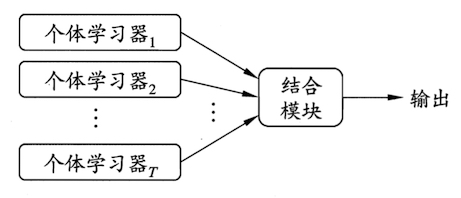
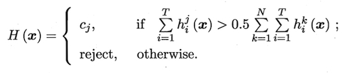
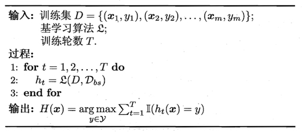

# 集成学习概述

## 1. 什么是集成学习

集成学习（ensemble learning）通过**构建并结合多个学习器**来完成学习任务，有时也被称为多分类器系统（multi-classifier system）、基于委员会的学习（committee-based learning），其一般结构如下图所示：

要获得好的集成学习效果，我们希望各个体学习器应==“好而不同”==，即个体学习器要有一定的“准确性”，并且要有“多样性”，即学习器之间具有差异。

但事实上，个体学习器的“准确性”和“多样性”本身就存在冲突。如何产生并结合“好而不同”的个体学习器，是集成学习研究的核心。

## 2. 学习器结合策略

学习器结合可能会从三个方面带来好处：

1. 从统计角度看，由于学习任务的假设空间往往很大，可能有多个假设在训练集上达到同等性能，此时若使用单个学习器可能因为误选而导致**泛化性能不佳**，结合多个学习器可以减小这一风险；
2. 从计算角度看，学习算法往往会陷入局部极小，通过多次运行之后进行结合，可**降低陷入糟糕局部极小的风险**；
3. 从表示的角度看，结合多个学习器由于相应的假设空间有所扩大，有可能学得更好的近似。

假设集成包含$T$个基学习器${h_{1},h_{2},\cdots ,h_{T}}$，其中$h_{i}$在示例$\boldsymbol{x}$上的输出为$h_{i}(\boldsymbol{x})$.

### 2.1 平均法

#### 简单平均

$$
H\left( \boldsymbol {x} \right) =\frac { 1 }{ T } \sum _{ 1 }^{ T }{ h_{ i } } \left( \boldsymbol {x} \right)
$$

#### 加权平均
$$
H\left( \boldsymbol {x} \right) =\frac { 1 }{ T } \sum _{ 1 }^{ T }w_{i}{ h_{ i } } \left( \boldsymbol {x} \right) \\
s.t. \space w_{i} \ge 0,\sum _{ 1 }^{ T }w_{i}=1
$$

### 2.2 投票法

设

1. 类别标记集合：$c_{1},c_{2},\cdots ,c_{N}$

2. $h_{i}$在样本$\boldsymbol{x}$的预测输出为一个$N$维向量$({ h }_{ i }^{ 1 }(\boldsymbol x);{ h }_{ i }^{ 2 }(\boldsymbol x);\cdots ;{ h }_{ i }^{ N }(\boldsymbol x))$，其中${h}_{i}^{j}(\boldsymbol x)$是$h_{i}$在类别标记$c_{j}$上输出。

#### 绝对多数投票法

绝对多数投票法有“拒接预测”选项，如果学习任务必须提供预测结果，可退化为如下的相对多数投票法。

#### 相对多数投票法

$$
H\left( \boldsymbol{x} \right) ={ c }_{ \underset { j }{ \text{arg max} } \sum _{ i }^{ T }{ { h }_{ i }^{ j } } \left( \boldsymbol{x} \right)  }
$$

如果有多个标记同时获得最多票，则随机选取一种一个。

#### 加权投票

$$
H\left( \boldsymbol{x} \right) ={ c }_{ \underset { j }{ \text{arg max} } \sum _{ i }^{ T }w_{i}{ { h }_{ i }^{ j } } \left( \boldsymbol{x} \right)  }
$$

## 3. 集成学习器分类

根据个体学习器的生成方式，目前的集成学习方法大致可分为两类：

1. 个体学习器之间存在强依赖关系，必须串行生成的序列化方法，代表是Boosting；
2. 个体学习器不存在强依赖关系、可同时生成的并行化方法，代表是Bagging和Random Forest。

### 3.1 Boosting

#### 3.1.1 工作机制

先从初始训练集训练出一个基学习器，再跟进基学习器的表现对训练样本进行调整，使得先前基学习器做错的训练样本在后续受到更多关注，然后基于调整后的样本分布来训练下一个基学习器；如此重复，直至基学习器数目达到事先指定的值$T$，最终将这$T$个基学习器进行加权结合。

从偏差-方差分解的角度看，Bagging主要关注降低偏差。

#### 3.2.2 Boosting族代表算法

1. [AdaBoost](https://www.jianshu.com/p/9c63ce0344b7)

2. [GBDT](https://www.jianshu.com/p/e5d27d985194)
3. [XGBoost](https://www.jianshu.com/p/ec504681ddea)

### 3.2 Bagging

Bagging（Booststrap Aggregating的缩写），最早由Breiman于1996年提出。

每个基学习器的训练样本是通过自助采样法（bootstrap sampling，就是对原始数据集进行有放回的采样）获得。

算法描述如下图：

其中，$\mathcal{D_{bs}}$是自助采样产生的样本分布。

从偏差-方差分解的角度看，Bagging主要关注降低偏差。

### 3.3 Random Forest

[随机森林](https://www.jianshu.com/p/ced381c06e72)是Bagging的一个扩展变体.RF在以决策树为基学习器构建Bagging集成的基础上，进一步在决策树的训练过程中引入了**随机属性选择**。

随机森林的详解见【[Random Forest理解](https://www.jianshu.com/p/ced381c06e72)】

## 参考

[1]周志华.机器学习[M].清华大学出版社:北京,2016:170.
[2]李航.统计机器学习[M].清华大学出版社:北京,2012:137.